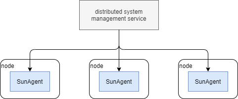

# SunAgent

| [License: MIT](LICENSE) | [Language: Go](https://golang.org/) | [Release: 1.1.0](docs/RELEASE_NOTES.md) |

SunAgent is a lightweight cross-platform remote node operation service.

Typically, the client of SunAgent is typically a distributed system management service. It could get system information, execute scripts, create files, etc., on the nodes it manages, remotely via SunAgent. The client only need to care about what to do, but care little about how to do, especially how to accomplish the same task on different platforms. For example, installing software "foobar" should do "apt-get install foobar" on debian but "yum install foobar" on redhat. Clients only tell SunAgent to "install a software foobar" regardless of the node should install it by apt-get or by yum. SunAgent encapsulates the actual way to accomplish the installation.

A node infer to some computing resource. It may be a host, a virtual machine, or a container. Different kind of node could do different operations. For example, you cannot call systemctl in docker container without setting docker entrypoint as /usr/sbin/init. SunAgent provides functionalities that work on a host, though some of them may fail in a container.



SunAgent exposes its functionality by common protocals. Currently there is only HTTP APIs.

## Build & Run

Run below command to build the executable. The executable and other files necessary to run it will be output to path *gen*.
```sh
# Linux:
./make.sh

# Windows:
make.bat
```

Run below command to start the process.
```sh
# Linux:
./gen/sunagentd --config=gen/config.conf --grimoire=gen/grimoires

# Windows:
gen\sunagentd.exe --config=gen\config.conf --grimoire=gen\grimoires
```

## API Reference

All SunAgent features could be consumed by HTTP API. Please refer to [here](docs/API_REFERENCE.md) for the HTTP APIs provided by SunAgent.

## Configuration

Configuration is defined by [etc/config.conf](etc/config.conf).

*GO* section defines behaviors of the process. They are all go related parameters since SunAgent is implemented by go:

* gomaxprocs: The maximum processors used.

*CORE* section defines behaviors of the framework.

* jobCleanThreshold: Threshold of when job clean should occur. If the number of jobs exceeds the threshold, half of the finished jobs with earliest creation time will be removed, i.e., could get their info no more. In-proguress jobs will not be removed.

*HTTP* section defines the parameters of the HTTP server who exposes HTTP APIs:

* ip: IP address of the HTTP server. This option is introduced because there may be multiple network adaptors with different IP addresses in the node.
* port: Port number of the HTTP server.
* auth: The type of authorization. Valid values are *none*, *basic*.
* user: User of the basic authorization.
* password: Password of the basic authorization.

*LOG* section defines behaviors of logging.

* level: Log level. Valid values are *debug*, *info*, *warn*, *error*, *fatal* (from lower to higher).
* filelimitmb: Log file size limit by MB. When the log file exceeds the limit, it will be rotated.

## Support Matrix

| Operation          | Windows | Ubuntu | CentOS | Debian | OpenSUSE |
| ------------------ | ------- | ------ | ------ | ------ | -------- |
| File Management    | x       | x      | x      | x      | x        |
| Process Management | x       | x      | x      | x      | x        |
| System Information | x       | x      | x      | x      | x        |
| Script Execution   | x       | x      | x      | x      | x        |
| Package Management |         | x      | x      | x      | x        |

## Test

To run tests, use *test.py*:
* Run ```python3 test.py -h``` to see the usage.
* Run ```python3 test.py -t unit``` to run unit test.
* Run ```python3 test.py -t func``` to run functionality test.
* Run ```python3 test.py``` to run all tests.

Note:
* *test.py* requires python 3.8 and packages illustrated in *requirements.txt*.
* Your python 3 must use "python3" as the python executable name (either the binary file or a symbolic link to it) instead of "python". This restriction is to avoid disrupting RPM, which depends on python 2.

## Architecture

Please refer to [here](docs/ARCHITECTURE_SPECIFICATION.md) for the architectural design.

## Extensibility

Please refer to [here](docs/EXTENSIBILITY.md) for how to extend the features.

## Versioning

The version of SunAgent has the format of *major.minor.patch*.

* If some fixes are patched, *patch* component of the version will increase.
* If new features are introduced, *minor* component of the version will increase and *patch* component will return zero.
* If the new version introduced change that is not backward compatible, *major* component of the version will increase while *minor* component and *patch* component will return zero.

For the details of the changes, please refer to the [release notes](docs/RELEASE_NOTES.md).
