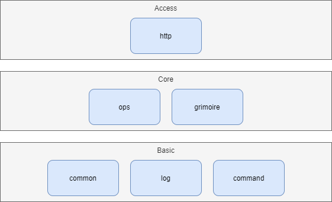

# Architecture Specification

SunAgent provides a number of node operations. Each operation is implemented as a function. The functions are the core part of SunAgent. Functions may depend on each other. Most of them are implemented by calling standard or third-party libraries, along with some result fabrication logics.

There are some functions are implemented by calling system command. A package named *grimoire* is designed to mapping specific operations to corresponding system commands of the platforms that SunAgent runs on. This is SunAgent's solution to make the system commands of the operations transparent to the client.

The functions are exposed to client by common protocals as APIs. Currently there is only HTTP.

## Layers & Packages

SunAgent has 3 layers.

The basic layer includes packages that is commonly shared by above layers:
* *common* package defines the internal error type and declares globals.
* *log* package encapsulates *sirupsen/logrus* to define SunAgent specific log functionns.
* *command* package enhances the system command execution behaviors.

The core layer includes packages that implements the functionality provided by SunAgent:
* *ops* package implements the functions of node operations.
* *grimoire* package implements a way to mapping specific operations to corresponding system commands of the platforms that SunAgent runs on, which is depended on by *ops* package.

The access layer includes packages that expose the functions of SunAgent by common protocals:
* *http* package exposes the functions with HTTP.

## Grimoire

A grimoire is a set of operations for a specific OS type. It could be configured by a YAML file that is named as *{OS type}.yaml*. You could refer to [linux.yaml](../etc/grimoires/linux.yaml) for the syntax.

An arcane is a specific operation. It defines the timeout by seconds and a set of spells that correspond to OS families

A spell defines a specific system command to be executed. The parameters take *{}* as the place holder. If the spell contains literal *{}*, use *{{}}* to escape it.

When an operation is executed, the corresponding system command of the running OS type and family configured by the grimoire file will be called.
