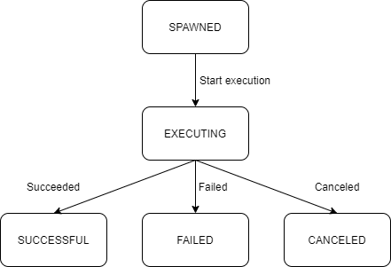

# Architecture Specification

SunAgent provides a number of node operations. Each operation is implemented as a function. The functions are the core part of SunAgent. Functions may depend on each other. Most of them are implemented by calling standard or third-party libraries, along with some result fabrication logics.

There are some functions are implemented by calling system command. A package named *grimoire* is designed to mapping specific operations to corresponding system commands of the platforms that SunAgent runs on. This is SunAgent's solution to make the system commands of the operations transparent to the client.

The functions are exposed to client by common protocals as APIs. Currently there is only HTTP.

## Layers & Packages

SunAgent has 3 layers.

The basic layer includes packages that is commonly shared by above layers:
* *common* package defines the internal error type and declares globals.
* *log* package encapsulates *sirupsen/logrus* to define SunAgent specific log functionns.
* *command* package enhances the system command execution behaviors.

The core layer includes packages that implements the functionality provided by SunAgent:
* *ops* package implements the functions of node operations.
* *grimoire* package implements a way to mapping specific operations to corresponding system commands of the platforms that SunAgent runs on, which is depended on by *ops* package.

The access layer includes packages that expose the functions of SunAgent by common protocals:
* *http* package exposes the functions with HTTP.

## Grimoire

A grimoire is a set of operations implemented by system commands for a specific OS type. It could be configured by a YAML file that is named as *{OS type}.yaml*. You could refer to [linux.yaml](../etc/grimoires/linux.yaml) for the syntax.

An arcane is a specific operation. It defines the timeout by seconds and a set of spells that correspond to OS families

A spell defines a specific system command to be executed. The parameters take *{}* as the place holder. If the spell contains literal *{}*, use *{{}}* to escape it.

When an operation is executed, the corresponding system command of the running OS type and family configured by the grimoire file will be called. Since the cross-platform mechanism depends on [gopsutil](https://github.com/shirou/gopsutil), refer to [GOOS](https://pkg.go.dev/runtime#pkg-constants) for the literals of OS types and refer to [here](https://github.com/shirou/gopsutil/blob/master/host/host_linux.go#L281) for the literals of OS families.

## Background Job

Some operations could be executed as background jobs. So that a request could get response immediately instead of waiting for a long period. A background job is nothing more than an executing operation. It has following status:

* SPAWNED: The job is just created and about to execute. When it starts executing, it will have a status of EXECUTING.
* EXECUTING: The job is executing. When it is finished, it will have different status according to how it is finished.
* SUCCESSFUL: The job has finished and the execution was successful.
* FAILED: The job has finished and the execution was failed.
* CANCELED: The job was canceled during execution.

The job status could be retrieved after its creation. However, if the number of jobs exceeds the value of configuration *CORE.jobCleanThreshold*, part of the finished job status will be cleaned. Therefore, only the status of latest finished jobs and all executing jobs could be retrieved.

The job status is not persistent. All jobs will be lost after SunAgent is restarted. However, job IDs are guaranteed to be unique even if Sunagent is restarted.
